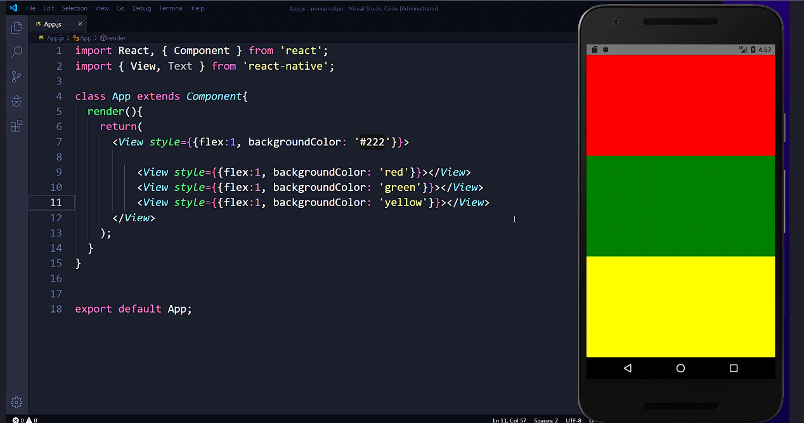
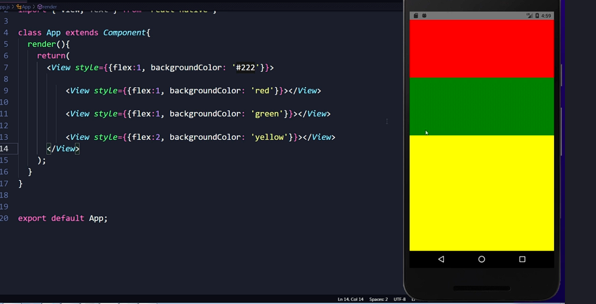

# ReactNative - 1.0

[](https://developer.mozilla.org/pt-BR/docs/Web/JavaScript)
[](https://reactnative.dev/)

Curso de React Native da Udemy: [React Native Criando aplicativos do zero ao avançado](https://www.udemy.com/course/crusoreactnative/)

React Native é um frameWork para desenvolvimento de **Apps** nativos para **Android** e **IOS** com um único código `javascript` combinado com `react`.

## EXPO GO

Para iniciar o projeto e realizar teste de execução utilizaremos o [Expo Go](https://docs.expo.dev/)

`npx create-expo-app@latest --template`

## Uma chave e Duas Chaves

Quando utilizamos duas chaves nas propriedades do componente estamos informando ao react native que iremos informar javascript.

```js
//Exemplo de duas chaves para utilizar js
<View>
  <Text style={{ color:'red'}}>Teste!</Text>
</View>
```

Quando utilizamos uma chave no valor do componente informamos ao react native que iremos utilizar uma variável.

```js
//Exemplo de uma chave para utilizar variável
const nome='Humberto'
<View>
  <Text>{nome}</Text>
</View>
```

## Orientação de desenvolvimento no React Native

Temos dois tipos de orientação de desenvolvimento: função e classe.

Na **orientação a função** utilizaremos funções que retornam tags de componentes (pré-desenvolvidos como View, Text, etc), HTML e CSS.

Exemplo:

```js
//JS
export function default App(){
    return(
        <View>
            <Text>
                Olá mundo
            </Text>
        </View>
    )
}
```

Já na **orientação a classe** utilizaremos `class` para abranger nossos componentes.

Exemplo:

```js
//JS
import React, { Component } from 'react';
import { View, Text } from 'react-native'

class App extends Component{
  render(){
    return(
      <View>
        <Text>Teste</Text>
      </View>
    )
  }
}

export default App;
```

### Orientação a classe

Podemos criar vários componentes que podem ser reutilizados no react native e um método para isso é criar componentes como classes.

Para isso precisamos criar uma `class` (depois o nome da classe) e extender as características de Componente com `extends Component`, abrir chaves e utilizar a função `render()` depois abrir chaves novamente, dar o return e abrir parenteses, como no exemplo no tópico acima. Todos esses passos são obrigatórios para utilizar orientação a classe.

Depois podemos chamar o componente, normalmente dentro do componente principal ou de outro componente.

### Passando propriedades para Components Personalizados

Podemos passar propriedades personalizadas para nossos componentes quando chamamos eles como fazemos nos componentes padrões, a diferença vai estar lá dentro do nosso componente personalizado.

```js
//Exemplo de Propriedades personalizadas no componente personalizado
<View>
  <BoxImageProps largura={'100%'} altura={'35%'}/>
</View>
```

A diferença esta dentro do componente, onde vamos utilizar o `this.props.` para acessar a propriedade passada e utilizar ele como valor.

```js
//Exemplo de Componente personalizado utilizando as propriedades passadas no exemplo anterior
class BoxImageProps extends Component{
  render(){
    return(
      <Image 
        source={{uri:'https://i.pinimg.com/474x/d4/6e/1d/d46e1db4b0fcb94555ddf037a1a9c7f9.jpg'}} 
        style={{width:this.props.largura, height:this.props.altura, marginTop:15}}
      />
    )
  }
}
```

### Precisa utilizar uma View mãe no componente?

Caso seja retornado apenas uma 'tag' não precisa, mas caso retorne mais de uma 'tag' (componente) obrigatoriamente eles devem estar dentro de uma View mãe

## Componentes Padrão

### View

Todo componente deve ter uma View mãe que engloba todo seu conteúdo.

Para garantir que a View mão ocupe todo o conteúdo, podemos passar o style com `flex:1` garantindo que vai ocupar todo o espaço d atela.

```js
<View style={{flex:1}}>
  <Text>Olá mundo!</Text>
</View>
```

### Style

Todo componente tem propriedades como por exemplo `style`.

Para ciar estilo de em um componente utilizamos a propriedade style com um igual e com a abertura de chaves e para escrever em linha o estilo precisamos abrir uma segunda chave.

#### Style In line

```js
//Exemplo de aplicação de estilo em linha  (style in line)
<View>
  <Text style={{ color:'red', backgroundColor: '#123456', fontSize:15 }}>Teste!</Text>
</View>
```

Repare que podemos ter mais de um estilo aplicado, basta separar por vírgula.

Importante ressaltar que os estilos do react native não tem espaço,  sempre que tem mais de uma palavra, elas estarão juntos, sendo que a segunda iniciará com letra maiúscula (camelCase).

Por padrão não informamos `px` aos estilos que utilizam pixel, somente o numero, o react native da entende que é pixel e aplica, se escrever px depois do numero gera erro.

Para utilizar porcentagem para estilos como width, tem que colocar dentro de aspas e com o porcentagem depois dos números.

#### Style como variável (StyleSheet)

Podemos criar variáveis que vão funcionar como as "classes" do `css`, facilitando a reutilização do estilo para vários componentes, elas são criadas com o método `StyleSheet.create({})`.

A criação da variável de estilo **deve ser fora do componente.**

Podemos aplicar mais de uma variável de estilo para um componente, basta usar a chaves e dentro dela usar colchetes para indicar ao react native que esse componente vai receber uma lista (array) de estilos,  `{[ style01, style02]}` como exemplo abaixo:

```js
class App extends Component{
  render(){
    return(
      <View style={styles.area} /* Usando Style Sheet*/>
        <Text style={[styles.TextoPrincipal,alinhaTexto]}> Texto 01<Text/>
        <Text style={alinhaTexto}> Texto 01<Text/>
        <Text style={styles.TextoPrincipal}> Texto 01<Text/>
      <View/>
    )
  }
}

const styles=StyleSheet.create({
  area:{
    marginTop:15
  },
  TextoPrincipal:{
    fontSizw:25,
    color:'#FF0000'
  }, 
  alinhaTexto:{
    textAlign:'center'
  }
})
```

#### Flexbox

Podemos utilizar o flex box para facilitar o desenvolvimento e o layout dos aplicativos no react native.

Como citado na sessão sobre a View, todo componente deve ser envolvido por uma View mãe e podemos utilizar `flex:1` para que ele ocupe todo o tamanho da tela.

Mas e os componentes filhos? Podemos utilizar o `flex:1` neles também, mas terá um comportamento um pouco diferente, caso tenha apenas um componente filho, ele ocupará toda a tela, mas cado tenha mais de um, o flexbox vai fazer com que ocupem o mesmo tamanho na tela, ou seja, se forem dois, cada um vai ocupar metade da tela, se for 3, cada um ocupa um terço da tela.



Caso queira que um dos componentes filhos ocupe o dobro que outro, basta definir `flex:2`, assim ele ocupará o dobro dos demais.



### TextInput

Para receber dados do usuário podemos utilizar o componente `<TextInput />`

#### Propriedades TextInput

**placeholder:** Texto que aparece por default no campo em cinza antes do usuário iniciar a digitação. 

**onChangeText:** Função que é executada quando digita no TextInput, ***por padrão ele retorna o texto digitado.***

### Button

Button é o mais básico botão do react native, ao ser pressionado ele executa uma função `onPress`.

#### Propriedades do Button

**title:** será o texto exibido dentro do `button`.

**onPress:**Função que é executada quando clicado no `button`.

### Image

Para que o react native renderize a imagem na tela obrigatoriamente tem que passar a propriedade style com dois estilos `width` e `height`.

Para utilizar imagens da internet através de url, tem que utilizar a propriedade source e dentro de duas chaves utilizar primeiro `uri:` e depois passar a url.

```js
//Exemplo de utilização de imagem  com url estática e com url variável
 const img = 'https://i.pinimg.com/474x/d4/6e/1d/d46e1db4b0fcb94555ddf037a1a9c7f9.jpg'
<View>
  <Image source={{uri:'https://i.pinimg.com/474x/d4/6e/1d/d46e1db4b0fcb94555ddf037a1a9c7f9.jpg'}}  style={{width:'100%', height:'80%'}}/>
  <Image source={{uri:img}}  style={{width:'100%', height:'80%'}}/>
</View>
```

## States

### States na orientação a classe

Para utilizar estados na orientação de classe precisa criar um construtor que recebe as propriedades atuais, definir uma propriedade `super(props)`que recebe as propriedades, depois utilizamos o `this.state` que recebe os estados, podendo passar mais de um como exemplo:

```js
//Exemplo de estado com classe
 class App extends Component {
  constructor (props){
    super(props);
    this.state={
      nome:'Humberto',
      sobrenome:'Caio',
      alternativeName:'Nome alternativo'
    };
  }
```

Para que possamos alterar os valores dos estados precisamos utilizar o método `this.setStates`.

Mas para isso precisamos deixar que a função possa acessar todas as propriedades e estados, dando um `.bind` dentro do construtor na função que vai alterar o valor.

Lembrando que se passar o novo valor direto na função precisa ter uma função anonima.

```js
  class App extends Component {
    constructor (props){
      super(props);
      this.state={
        nome:'Humberto',
        sobrenome:'Caio',
        alternativeName:'Nome alternativo'
      };
      this.inverte = this.inverte.bind(this) //Dando bind na função
      this.entrar = this.entrar.bind(this) //Dando bind na função
    }

    inverte(){
      const auxNome = this.state.nome
      this.setState({ //Alterando o valor do estado
        nome:this.state.sobrenome,
        sobrenome: auxNome
      })
    }

    entrar(nome){
      this.setState({ //Alterando o valor do estado
        alternativeName:nome
      })
    }
    render() {
      const nome = "Humberto";
      return(
        <View>
          <Button title="Inverter nome sobrenome" onPress={this.inverte}/>
          <Button title="Altera nome alternativo" onPress={()=>this.entrar('Carlos Roberto')}/>
        <View/>
      )
  }
```
